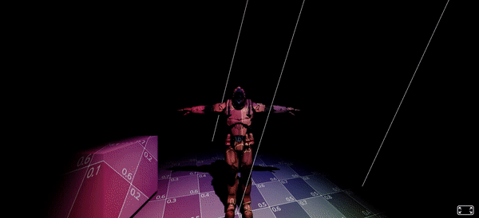

# A-Frame-Spotlight-with-Texture-Component



### **Description / Rationale**
This is an A-Frame component, which demonstrates spotlight with texture. It can also be called as a projected texture component because texture is dynamically projected on mesh surfaces. The component was created based on the works by Marco Fugaro named <a href="https://github.com/marcofugaro/three-projected-material">Three Projected Material</a>, <a href="https://github.com/marcofugaro/codrops-texture-projection">Codrops Texture Projection</a> as well as Spotlight example provided in <a href="https://threejs.org/examples/#webgl_lights_spotlight">Three.js library</a>.     

### **Instructions**
In order to use the component attach "spotlight-texture" to "a-scene". The component has the following attributes: 
* <b>lightHelper: { type: 'boolean', default: true }</b> - spotlight helper. It helps to see the location and direction of spotlight in the scene.
* <b>spotlightShadow: { type: 'boolean', default: false }</b> - enables or disables shadow of 3d objects. Requires that objects in scene have "shadow='cast: true'" attribute.
* <b>spotlightDynamic: { type: 'boolean', default: false }</b> - Adds spotlight animation (movement). If disabled, spotlight becomes static. 
* <b>spotlightColor: { type: 'color', default: '#ffffff' }</b> - The color of the spotlight.
* <b>spotlightIntensity: { type: 'float', default: 10 }</b> - Intensity of the spotlight.
* <b>spotlightDistance: { type: 'float', default: 100 }</b> - Distance of the spotlight.
* <b>spotlightAngle: { type: 'float', default: 0.5 }</b> - Angle of the spotlight. Accepts float values from 0.0 to 1.0
* <b>spotlightPenubra: { type: 'float', default: 1 }</b> - Penumbra of the spotlight.
* <b>spotlightDecay: { type: 'float', default: 2 }</b> - Decay of the spotlight.
* <b>spotlightFocus: { type: 'float', default: 1 }</b> - Focus(size) of the spotlight.
* <b>spotlightPosition: { type: 'vec3', default: { x: 10, y: 35, z: 10 } }</b> - Position of the spotlight.
* <b>imgTexture: { type: 'boolean', default: true }</b> - If enabled projects image texture over objects in scene. If disabled projects video over objects in scene. 
* <b>imgTextureSrc: { type: 'string', default: '' }</b> - Source/URL of image texture.
* <b>videoTextureSrc: { type: 'string', default: '' }</b> - source/URL of video texture.

The code below shows the sample implementation of the component. Please make sure to disable default lights in scene so that the component takes over (light="defaultLightsEnabled: false"):
```
<!DOCTYPE html>
<html lang="en">
<head>
    <title>SpotLight Texture Component (aka Texture projection)</title>
    <meta charset="utf-8">
    <meta name="viewport" content="width=device-width, user-scalable=no, minimum-scale=1.0, maximum-scale=1.0">
    <script src="https://aframe.io/releases/1.4.2/aframe.min.js"></script>
    <script src="js/spotlight-texture-component.js"></script>
</head>
<body>
    <a-scene light="defaultLightsEnabled: false" 
    spotlight-texture="
    lightHelper: true; 
    spotlightShadow: true; 
    spotlightDynamic: true;
    spotlightColor: #ffffff;
    spotlightIntensity: 15;
    spotlightDistance: 90;
    spotlightAngle: 0.5;
    spotlightPenubra: 1;
    spotlightDecay: 2;
    spotlightFocus: 1;
    spotlightPosition: 0, 40, 0;
    imgTexture: false;
    imgTextureSrc: textures/uvGrid.jpg;
    videoTextureSrc: textures/trailer.mp4
    ">
        <a-camera position="0 15 20"></a-camera>
        <a-box scale="10 10 10" position="-20 5 0" shadow="cast: true"></a-box>
        <a-gltf-model src="models/soldier.glb" scale="10 10 10" rotation="0 180 0" shadow="cast: true"></a-gltf-model>
        <a-sky color="#000000"></a-sky>
    </a-scene>
</body>
</html>
```

### **Tech Stack**
The project is powered by AFrame and Three.js. 

### **Demo**
See demo of the component here: [Demo](https://spotlight-texture.glitch.me/)
